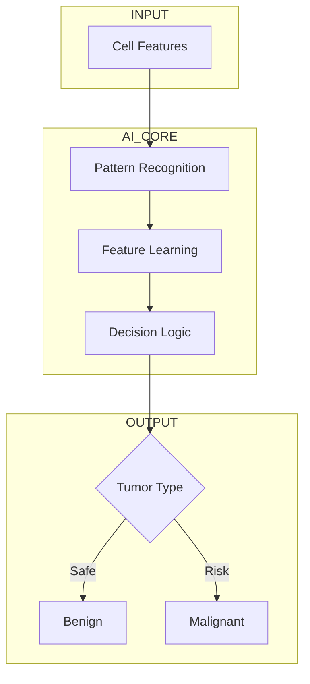

# 🧬 Breast Cancer Intelligence Engine  
### ⚕️ AI for Early Detection & Smart Diagnosis  

<p align="center">
  
</p>

<p align="center">
  
  
  
</p>

<p align="center">
  <b>🧬 Detect Patterns | ⚕️ Assist Diagnosis | ❤️ Save Lives</b>
</p>

---

## 🧠 The Idea  

```
   🔬 Raw Cell Data  
          ↓  
   🧠 AI Brain Learns Patterns  
          ↓  
   ⚖️ Decision Engine  
          ↓  
   ❤️ Life-Saving Prediction
```

> This project transforms **microscopic cell features** into **intelligent medical decisions**

---

## 🧬 What Makes This Different?

✨ Not just prediction — **medical intelligence system**  
✨ Focused on **early detection (critical in healthcare)**  
✨ Converts **complex biological signals → simple decisions**  
✨ Designed like a **mini diagnostic engine**

---

## ⚙️ System Flow (Different Style)



---

## 🧬 Biological Features Modeled  

```
🧪 Radius        → Size indicator  
🧪 Texture       → Cell variation  
🧪 Perimeter     → Boundary complexity  
🧪 Area          → Growth scale  
🧪 Smoothness    → Uniformity  
🧪 Concavity     → Abnormal structure  
🧪 Symmetry      → Shape balance  
🧪 Fractal Dim   → Structural complexity  
```

---

## 🧠 AI Brain (Model Thinking)

```
IF (high radius + high concavity + irregular shape)
    → Likely Malignant ❗
ELSE
    → Likely Benign ✅
```

---

## 🎯 Prediction Output  

| Input Condition | AI Decision |
|---------------|-----------|
| Normal cell pattern | 🟢 Benign |
| Irregular aggressive pattern | 🔴 Malignant |

---

## 🛠️ Tech Behind the Brain  

```
🐍 Python
📊 Data Science Stack
🤖 Machine Learning Models
📉 Statistical Learning
```

---

## 📂 Project DNA  

```
🧬 Breast-Cancer-Prediction
│── 🧠 Model Notebook
│── 📊 Dataset
│── 📄 README
```

---

## 🚀 Run The Intelligence  

```bash
git clone https://github.com/your-username/breast-cancer-prediction.git
cd breast-cancer-prediction
pip install -r requirements.txt
jupyter notebook
```

---

## ❤️ Real-World Impact  

```
Early Detection = Higher Survival Rate
AI Assistance = Faster Diagnosis
Automation = Scalable Healthcare
```

---

## 🌌 Future Evolution  

🚀 AI + Medical Imaging (CNN)  
🧠 Explainable AI for doctors  
📱 Mobile diagnosis assistant  
🌐 Real-time hospital integration  

---

## 💡 Philosophy  

> “AI is not replacing doctors —  
> it is empowering them.”

---

<p align="center">
  🧬 Built where AI meets Humanity ❤️
</p>
